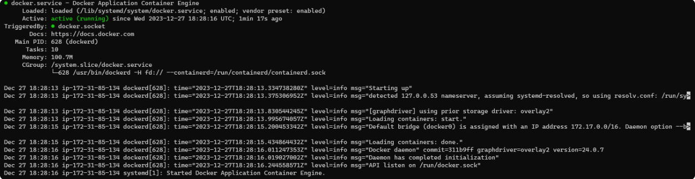
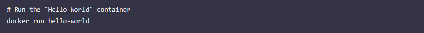
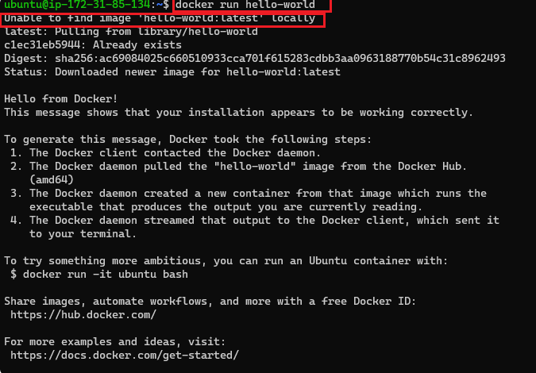
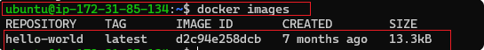
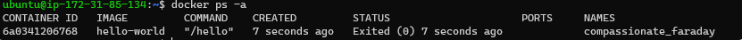
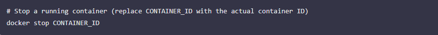
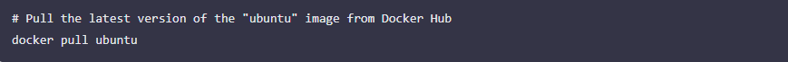
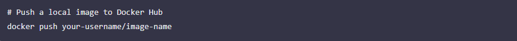
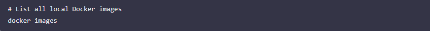
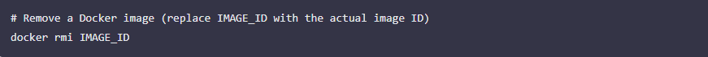

# Introduction-to-Docker
This project introduces Docker, a platform designed to simplify application deployment, scaling, and management using lightweight and portable containers. It explores the core concepts of containerization, Docker images, and containers, while also demonstrating how to build, run, and manage containerized applications through practical examples.

## What are Containers?
```
In software development, one common challenge has been the “it works on my machine” problem, where code that runs smoothly on a developer’s computer fails in testing or production. This usually happens because of differences in environments—such as operating systems, libraries, dependencies, or configurations—that create inconsistencies and unexpected errors.

Containers solve this issue by packaging an application together with everything it needs to run, including libraries, runtime, and configuration files. This makes them lightweight, portable, and consistent across any environment, whether on a local machine, a server, or in the cloud. By standardizing environments and isolating applications, containers ensure reliability, simplify deployment, and streamline the development lifecycle.

Docker started in 2013 when Solomon Hykes introduced it to solve a big problem in the IT industry. It’s a container platform that changed the way developers build, share, and run applications.

Think of containers as boxes that hold everything an app needs—its code, libraries, and settings. With Docker, apps run the same way everywhere: on a laptop, a test server, or in production. This means developers no longer have to worry about the old “it works on my machine” problem.
```
```
As a learner, you might be asking: why should I learn Docker? The answer is simple—Docker makes working with applications much easier. In the past, developers often struggled with complicated setups and compatibility problems. With Docker, those issues are gone. It creates containers, which are portable environments that hold everything an app needs to run. This ensures your application will work the same way on any computer, server, or cloud.
```
# Advantages of Containers
## Portability Across Different Containers:

The biggest advantage of containers is `portability`. Before Docker, moving apps between environments was stressful and error-prone. With Docker, your app and all its dependencies are bundled together, so it runs smoothly everywhere. This solves the “it works on my machine” problem and makes deploying applications fast, reliable, and stress-free.

## Resource Efficiency Compared to Virtual Machines:
```
Docker containers are lightweight because they share the host computer’s operating system instead of running a full separate OS like virtual machines. This means you can run many containers on a single computer without using too much memory or CPU. In other words, Docker lets your applications run efficiently, saving resources while still keeping everything organized and isolated.
```
## Rapid Application Deployment and Scaling:
```
Docker makes it easy to start or stop containers quickly, which helps you deploy applications fast. If your app suddenly needs to handle more users, you can launch more containers to meet the demand. When the demand drops, you can remove them just as easily. This makes scaling applications simple and flexible, allowing your software to adapt to changes smoothly without wasting resources.
```
## Docker vs Virtual Machines
```
Both Docker and virtual machines (VMs) are used to run applications in isolated environments, but they work differently. Virtual machines run a full operating system for each instance, which uses a lot of memory and takes longer to start. Docker, on the other hand, uses containers that share the host computer’s operating system. This makes Docker much lighter, faster, and more efficient. Containers start quickly, use fewer resources, and can run consistently on any system. While VMs are better for strong isolation, Docker is preferred for modern, fast, and scalable application development, especially when using microservices. The choice depends on whether you need maximum isolation (VMs) or speed and efficiency (Docker).
```
## Why Docker is Important
```
Docker has had a big impact on software development and IT operations. It solves common problems like apps working on one system but failing on another, by packaging the application with all its dependencies into a portable container. This ensures apps run the same way anywhere.

In real-world use, Docker helps teams work together more easily, speeds up application deployment, and improves scalability. It reduces resource use and makes software more consistent and reliable. Organizations can save time and money while building flexible and resilient applications.
```
## Who Should Learn Docker
```
Docker knowledge is useful for:
```
- `DevOps professionals:` 
  ```
  Want to deploy and manage applications efficiently, improve resource use, and keep systems stable.
  ```

- `Developers:` 
  ```
  Want consistent environments across development, testing, and production, and faster collaboration with teams.
  ```

- `Other tech enthusiasts:` 
  ```
  Cloud engineers, QA engineers, or students preparing for IT roles who want strong skills in Docker and containerization.
  ```
```  
Overall, Docker is ideal for anyone looking to improve their software development workflow, deploy applications quickly, and gain hands-on skills in modern IT practices.
```

# Getting Started with Docker

## Installing Docker

To begin, I used `Ubuntu 20.04 LTS instance` and connect to it.

Before we can install Docker Engine on a new system, I first need to set up the`Docker repository`. This ensures we always get the latest stable version of Docker and can easily update it in the future.

The first step is to add `Docker’s official GPG key`, which is used to verify that the software packages come from Docker and have not been tampered with.
```
sudo apt-get update
```
This is a `Linux command` used on Debian-based systems (like Ubuntu). It updates the local package list, which means it checks the software repositories for the most recent versions of available programs and updates. Running this command ensures your system knows about the latest software and security updates before you install or upgrade anything.
```
sudo apt-get install ca-certificates curl gnupg
```

This is a `Linux command` that installs some important tools needed for setting up and managing software. These include:

- `Certificate authorities (ca-certificates):` Help the system verify trusted websites and downloads.
- `Curl:` A tool used to transfer data from or to the internet, such as downloading files or accessing APIs.
- `GNU Privacy Guard (gnupg):` Provides secure communication and verifies the authenticity of software packages.
  
Together, these packages make sure your system can download software safely and verify that it hasn’t been tampered with.
```
sudo install -m 0755 -d /etc/apt/keyrings
```
The command creates a folder called `/etc/apt/keyrings` on your system. This folder is given permissions `0755`, which means the owner can read, write, and open it, while everyone else can only read and open it.

This folder is used to store `keyring files`, which hold security keys. These keys help the system verify that Docker’s software comes from a trusted source before installing it.
```
curl -fssL https://download.docker.com/linux/ubuntu/gpg | sudo gpg --dearmor -o /etc/apt/keyrings/docker -gpg
```

This command uses `curl` to download Docker’s official `GPG key`. The GPG key is a security file that helps your system check and verify that the Docker packages you install are genuine and haven’t been changed by anyone.
```
sudo chmod atr /etc/apt/keyrings/docker -gpg
```

This command changes the permissions of the Docker GPG key file stored in the `APT keyring directory.` It makes the file `readable by all users,` which ensures that the system can access the key whenever it needs to verify Docker packages.

After setting the permissions, the next step is to `add Docker’s repository` to the system’s APT sources. This allows Ubuntu to know where to find and download the official Docker software.
```
echo \
"deb [arch=$(dpkg --print-architecture) signed-by=/etc/apt/keyrings/docker-gpg] https://download.docker.com/linux/ubuntu \

$(- /etc/os-release && echo "$VERSION_CODENAME") stable* | \ sudo tee /etc/apt/sources.list.d/docker.list › /dev/null
```
The `echo` command creates a configuration entry for the Docker APT repository on your Ubuntu system. This entry includes your system’s `architecture` (for example, `amd64`) and links it to the `Docker GPG` key for security verification.

The second part, `sudo tee /etc/apt/sources.list.d/docker.list > /dev/null`, saves this configuration into a new file called `docker.list` inside the APT sources directory. This tells Ubuntu where to find and download official Docker packages in the future.
```
sudo apt-get update
```
- Install latest version of docker
```
sudo apt-get install
```
- Install latest version of docker
```
sudo apt-get install docker-ce docker-ce-cli containerd.io docker-build-plugin docker-compose-plugin
```
- Verify that docker has been successfully installed
```
Sudo systemctl status doccker
```


- After installing Docker, only the root user can run Docker commands, or you have to use `sudo` before each command. If you want to run Docker commands without typing `sudo` every time, you need to follow the steps below.
```
sudo usermod -aG docker ubuntu
```
- Once you run the command above, you will be able to use Docker commands without needing `sudo` or superuser privileges.

## Running the "Hello World" Container
## Using the 'docker run' Command

- The docker run command is used to start and run containers in Docker. It creates a container from a chosen Docker image and runs it. A simple example is the 'Hello World' container, which just prints a greeting message when you run it.



- When you run this command, Docker does three main things:

   - `Pulls the image` (if you don’t have it yet): Docker looks for the hello-world image on your computer. If it’s not there, it downloads it from Docker Hub, a place where Docker images are stored.
   - `Creates a container:` Docker makes a container from the hello-world image. This container is like a small, isolated environment where the image can run.
   - `Starts the container:` The container runs the command inside the image, which prints a friendly message on your screen.

## Understanding the Docker Image and Container Lifecycle
```
Docker Image: A Docker image is a self-contained package that has everything needed to run software, including the code, libraries, and system tools. Images cannot be changed once created—any changes create a new image.
```
`Container Lifecycle:` Containers are running instances of Docker images. They go through a lifecycle: `create → start → stop → delete`.` After a container is created, you can start, stop, or restart it as needed.

## Verifying Execution: 

You can check if the image is now available on your local system. Example output:
```
docker images
```


If you run into problems, make sure Docker is correctly installed and that your user has permission to run Docker commands.

This simple 'Hello World' example is a basic way to learn how Docker works. It shows that your Docker setup is working and helps you understand how images and containers work. Later in the course, you will learn to use Docker for more advanced tasks like building, deploying, and managing different applications.

# Basic Docker Commands

## Docker Run

The `docker run` command is used to start and run containers. It creates a container from a chosen image and then runs it.
```
# Run a container based on the "nginx" image
docker run hello-world
```
```
This example downloads the nginx image from Docker Hub if it’s not already on your computer, and then starts a container using that image.
```
## Docker PS
```
The docker ps command shows all the containers that are currently running. It helps you see details like container IDs, names, and their current status.
```
```
# List running containers
docker ps
```
To see all containers, including ones that have stopped, use the -a option with the command.
```
# List all containers (running and stopped)
docker ps -a
```


## Docker Stop
```
The docker stop command is used to stop a container that is currently running. When you run this command, Docker safely halts the container’s processes without deleting it, so you can start it again later if needed.
```


## Docker Pull
```
The docker pull command is used to download a Docker image from a registry, like Docker Hub, to your local computer. This lets you use the image to create and run containers on your machine.
```


## Docker Push
```
The docker push command is used to upload a Docker image from your local computer to a registry, such as Docker Hub. This makes the image available for others to download and use.
```

```
Before you can push an image to Docker Hub, make sure you are logged in. You can do this by running the docker login command and entering your Docker Hub username and password.
```
# Docker Images
```
The docker images command shows a list of all Docker images that are currently stored on your local computer. It provides details like image names, tags, IDs, and sizes.
```


## Docker RMI 
```
The docker rmi command is used to delete one or more Docker images from your local computer. This helps free up space or remove images you no longer need.
```

```
These basic Docker commands give you a foundation for working with containers. Knowing how to run, list, stop, pull, push, and manage Docker images is essential for using Docker effectively. As you learn more, you will discover additional commands and features that make it easier to develop, deploy, and manage applications in containers.
```

# Summary
```
Through this project, I have demonstrated the ability to understand and apply fundamental concepts of containerization. I explored how containers provide isolation and encapsulation, enabling applications to be packaged and executed consistently across different environments. I gained hands-on familiarity with Docker’s core features, essential commands, and recommended best practices, which form the backbone of efficient container management.

Additionally, I examined how Docker containers improve resource utilization and performance when compared to traditional virtual machines, highlighting their lightweight nature and reduced overhead. The project also emphasized Docker’s strength in ensuring consistent application behavior across development, testing, and production stages, thereby minimizing compatibility issues.

Finally, I developed practical skills in deploying and scaling applications rapidly using Docker. This includes leveraging Docker’s capabilities to streamline workflows, enhance scalability, and accelerate delivery pipelines, making it a powerful tool for modern software development and operations.
```